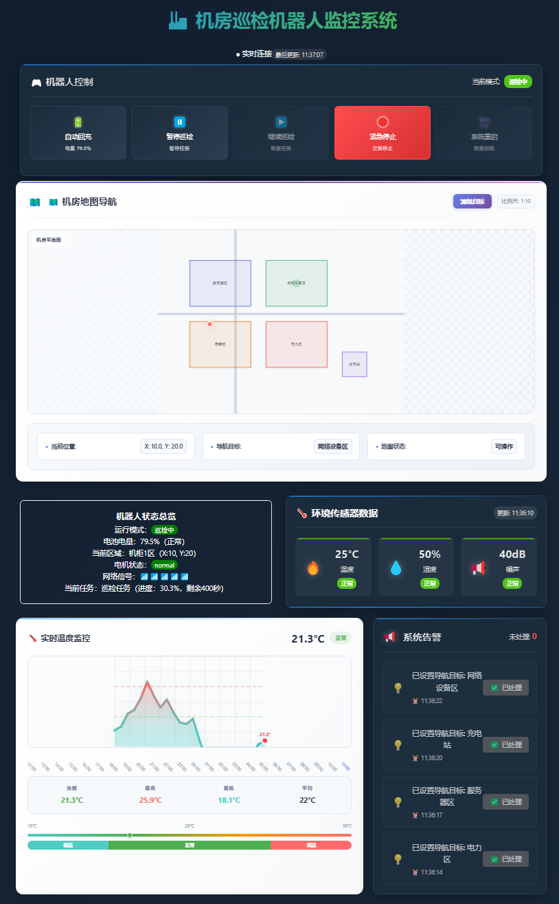

# Machine Room Inspection Robot Monitoring System  

An industrial-grade robot monitoring platform built with **React 18 + TypeScript**, providing real-time data visualization, intelligent alarms, and remote control for industrial automation operations.  


### 📸 System Preview  
(Insert a screenshot of the system here, e.g.)  
  


### 🛠️ Technology Stack  
- **Frontend Framework**: React 18 + TypeScript  
- **State Management**: Redux Toolkit  
- **Visualization**: ECharts  
- **Build Tool**: Vite  
- **Styling**: CSS3 (with a tech-inspired design)  


### ✨ Core Features  
#### Real-time Monitoring  
- 🤖 **Robot Status Tracking**: Real-time display of core metrics (battery, location, operation mode, etc.).  
- 📊 **Multi-sensor Data**: Real-time collection of environmental parameters (temperature, humidity, noise, etc.).  
- 📍 **Real-time Location Tracking**: Track the robot’s position in the machine room.  

#### Data Visualization  
- 📈 **Smart Charts**: 24-hour temperature trend analysis powered by ECharts.  
- 🎨 **Status Indicators**: Quick identification of system status via color coding.  
- ⏱️ **Real-time Updates**: Data pushed in real-time via MQTT.  

#### Alarm Management  
- 🚨 **Multi-level Alarm System**: Classify alarms into emergency, warning, and notice levels.  
- 🛠️ **Intelligent Handling**: One-click alarm resolution with real-time status synchronization.  
- 📋 **Historical Tracking**: Complete records of alarms and handling logs.  

#### Remote Control  
- 🎮 **Safe Operations**: Core functions (auto-recharge, pause inspection, resume task, etc.).  
- 🔍 **Status Verification**: Operation pre-check to prevent conflicting commands.  
- 🔄 **Operation Feedback**: Real-time operation result prompts and status updates.  

#### System Characteristics  
- 📱 **Responsive Design**: Perfectly adapts to desktop and mobile devices.  
- ✅ **TypeScript**: Full type safety to improve code quality.  
- ⚡ **Performance Optimization**: Strategies like component lazy loading, incremental chart updates, etc.  


### 🚀 Getting Started


```bash

npm install


npm run dev


npm run build

